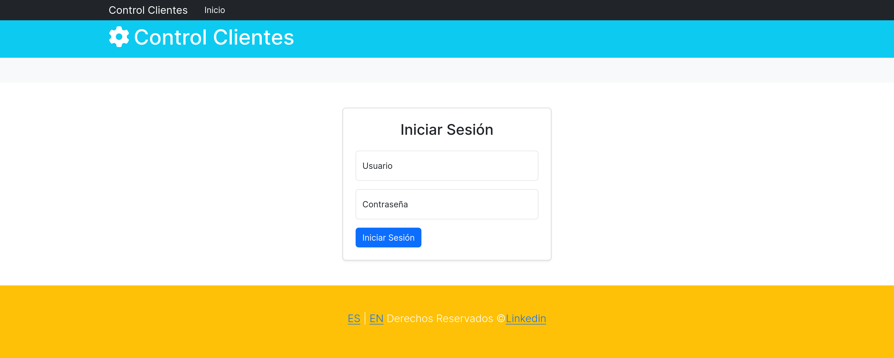
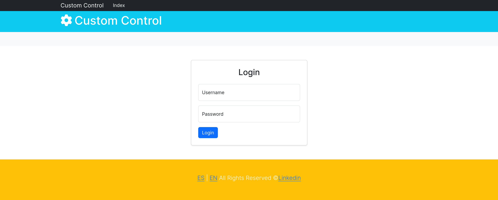
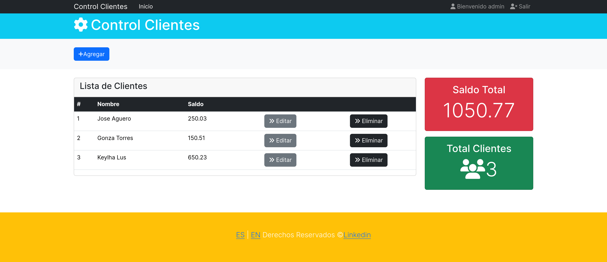
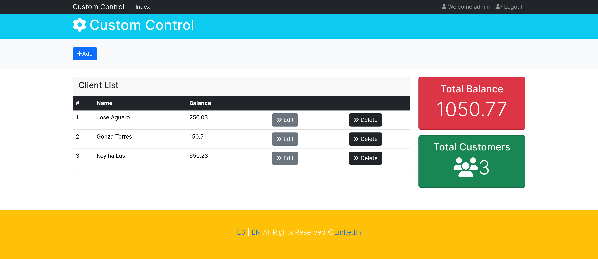
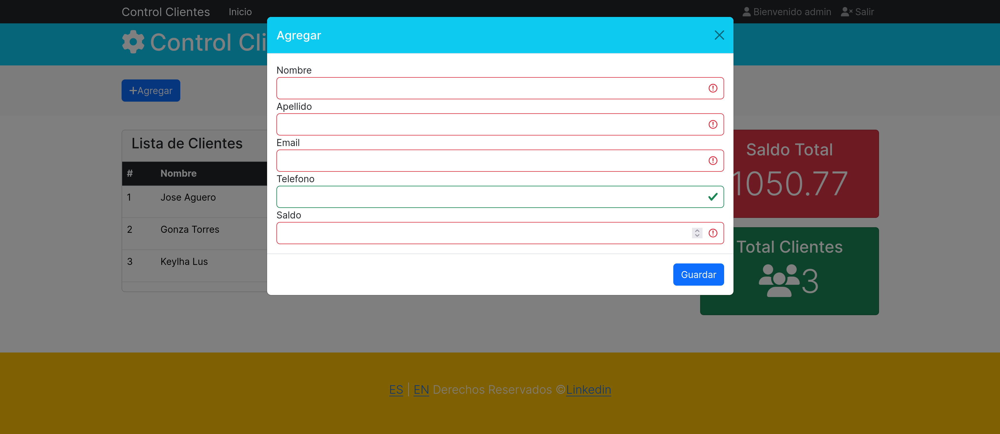
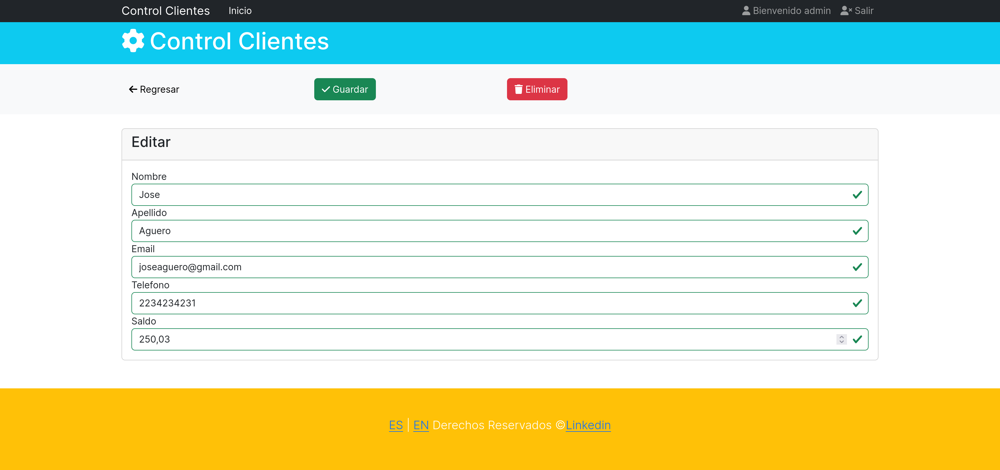
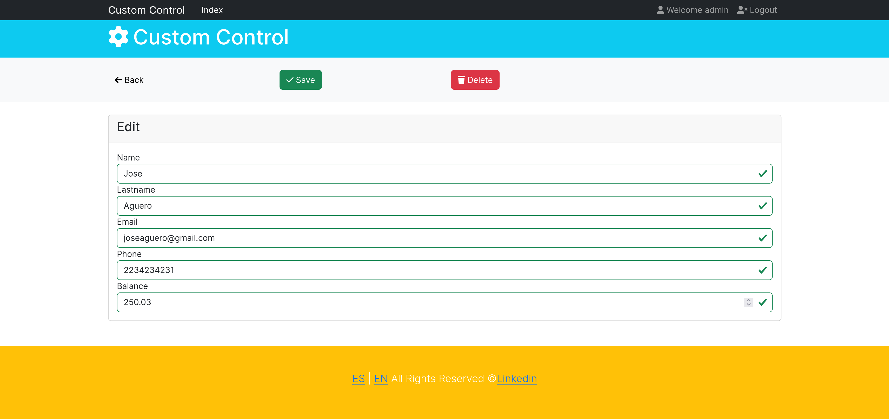
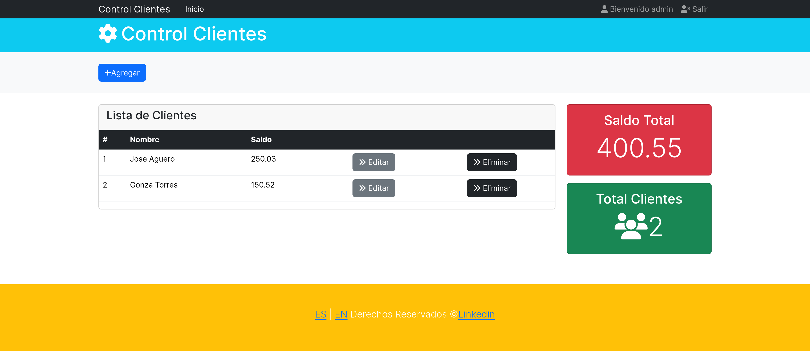

# Control de Clientes

## Descripción

Control de Clientes es una aplicación web desarrollada en Spring Boot que permite gestionar la información de los clientes. La aplicación proporciona funcionalidades para agregar, editar, eliminar y listar clientes. Además, incluye autenticación y autorización utilizando Spring Security, y soporte para internacionalización (i18n) con Thymeleaf.

## Características

- Gestión de clientes: agregar, editar, eliminar y listar clientes.
- Autenticación y autorización con Spring Security.
- Internacionalización (i18n) con Thymeleaf.
- Integración con Hibernate para la persistencia de datos.
- Formularios de inicio de sesión y registro de usuarios.

## Tecnologías Utilizadas

- Java
- Spring Boot
- Spring Security
- Thymeleaf
- Hibernate
- MySQL
- Bootstrap

## Vista Previa












## Requisitos Previos

- Java 11 o superior
- Maven
- MySQL

## Configuración del Proyecto

1. **Clonar el repositorio**:

   ```sh
   git clone https://github.com/tu-usuario/control-clientes.git
   cd control-clientes
